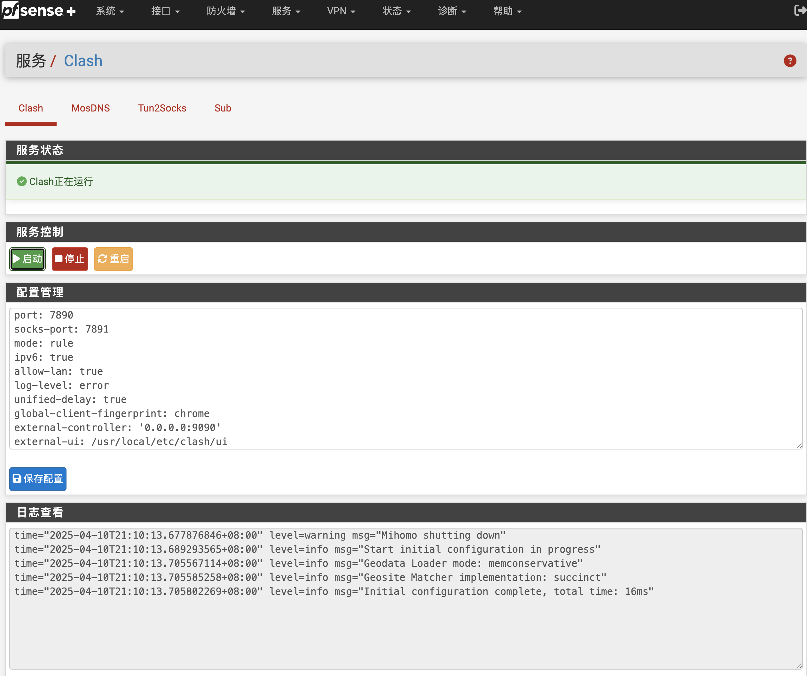
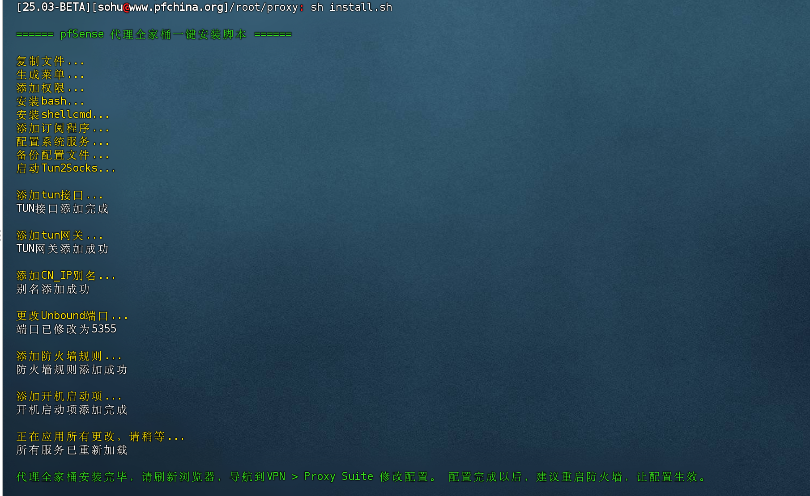

## Clash for pfSense
Clash安装工具，用于运行Clash、Tun2socks、Mosdns，在pfSense上实现透明代理。支持Clash订阅转换、DNS分流。带Web控制界面，可以进行配置修改、程序控制、日志查看。 在pfSense plus 25.03(beta)上测试通过。



## 项目源代码
该项目集成了以下工具：

[Mosdns](https://github.com/IrineSistiana/mosdns) 

[MetaCubeXD](https://github.com/MetaCubeX/metacubexd) 

[Subconverter](https://github.com/tindy2013/subconverter)

[clash (mihomo)](https://github.com/MetaCubeX/mihomo/releases) 

[hev-socks5-tunnel](https://github.com/heiher/hev-socks5-tunnel)

## 注意事项
1. 当前仅支持x86_64 平台。
2. 脚本不提供任何订阅信息，请准备好自己的Clash订阅URL。
3. 脚本会自动添加tun接口、china_ip别名、分流规则，可以根据需要进行手动修改。
4. 脚本已集成了可用的默认配置，只需替换clash的proxies和rule部分配置即可使用。
5. 为减少长期运行保存的日志数量，在调试完成后，请将所有配置的日志类型修改为error或warn。

## 安装方法
下载后解压，上传到防火墙根目录，进入安装目录，运行以下命令安装：

```bash
sh install.sh
```


## 使用方法
请参考以下文章：

[pfSense、OPNsense安装配置Clash透明代理教程](https://pfchina.org/?p=14148)

## 常见问题
如果订阅转换不起作用，可以使用[SublinkX](https://github.com/gooaclok819/sublinkX)工具搭建自己的订阅转换平台。
