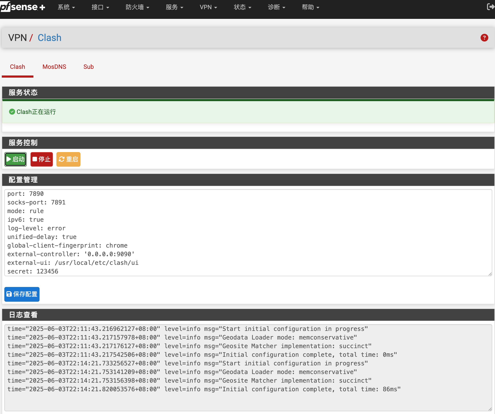

## Clash for pfSense
Clash安装工具，在pfSense上运行Clash、Mosdns，实现透明代理。支持Clash订阅、DNS分流。带Web控制界面，可以进行配置修改、程序控制、日志查看。在pfSense plus 25.03(beta)上测试通过。



## 集成程序

[MosDNS](https://github.com/IrineSistiana/mosdns) 

[Vincent-Loeng大佬魔改Mihomo](https://github.com/Vincent-Loeng/mihomo) 

## 注意事项
1. 当前仅支持x86_64 平台。
2. 脚本不提供任何订阅信息，请准备好自己的Clash订阅URL。
3. 脚本会自动添加tun接口、china_ip别名、分流规则，可以根据需要进行手动修改。
4. 脚本已集成了可用的默认配置，只需替换clash的proxies和rule部分配置即可使用。
5. 为减少长期运行保存的日志数量，在调试完成后，请将所有配置的日志类型修改为error或warn。

## 安装方法
下载后解压，上传到防火墙根目录，进入安装目录，运行以下命令安装：

```bash
sh install.sh
```


## 卸载方法
运行以下命令卸载：

```bash
sh uninstall.sh
```

## 使用方法
请参考以下文章：

[pfSense配置clash(mihomo)透明代理教程](https://pfchina.org/?p=10526)
